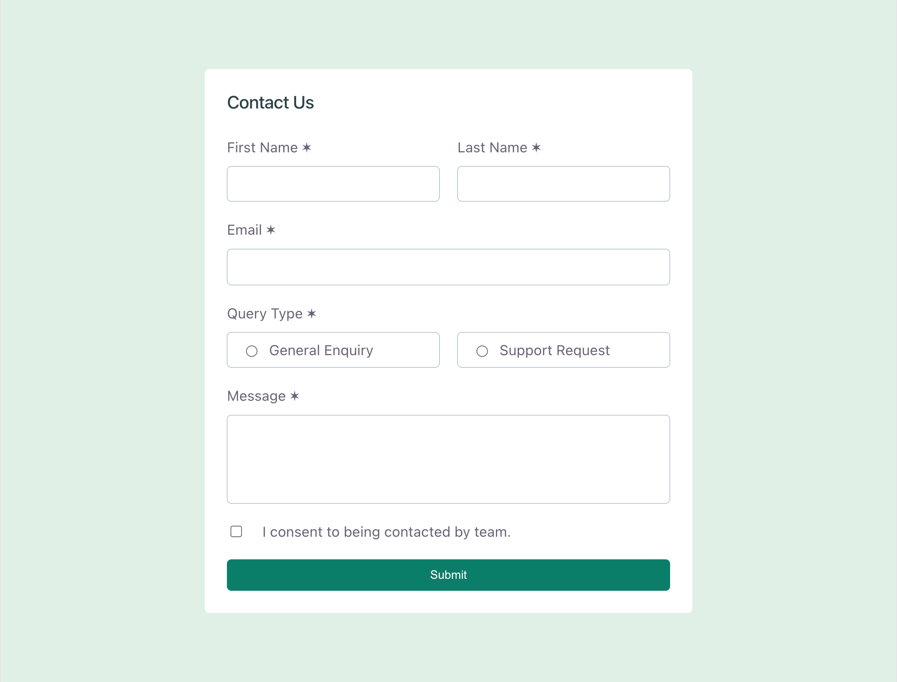
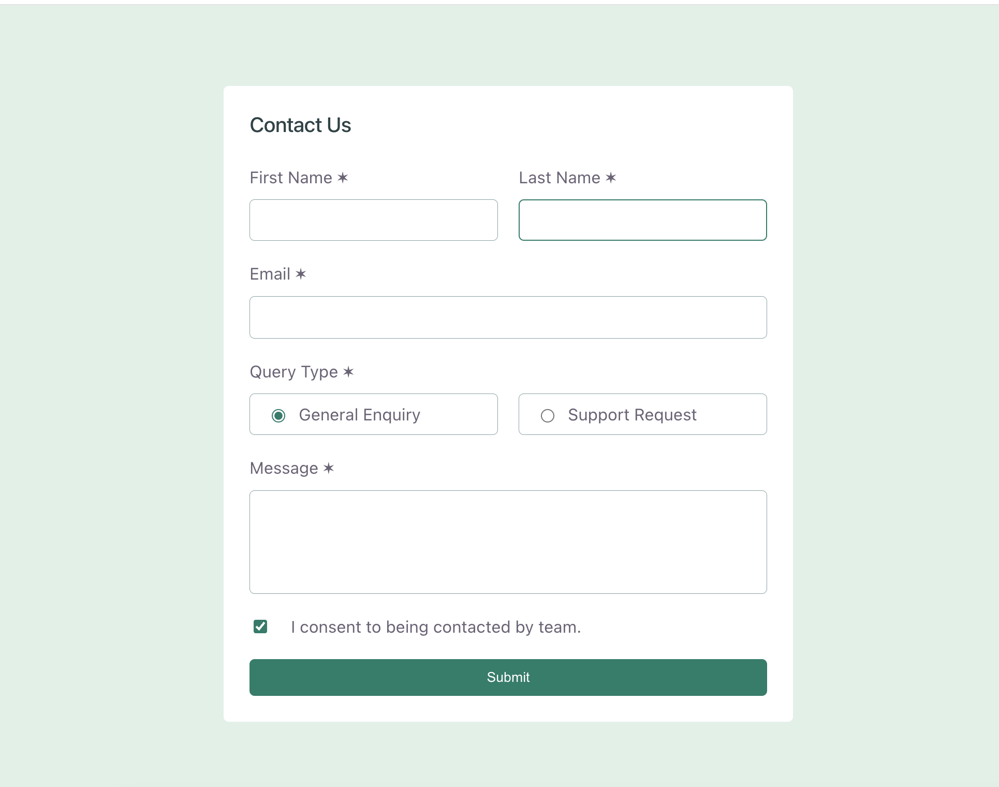
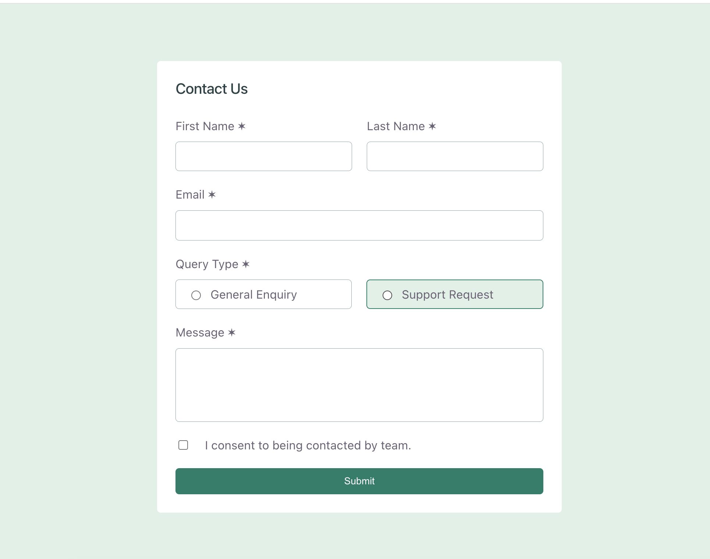
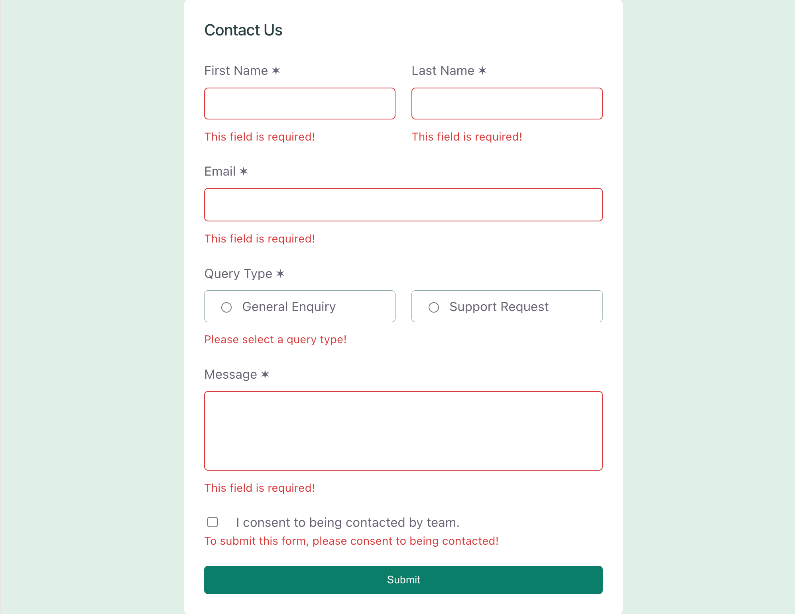
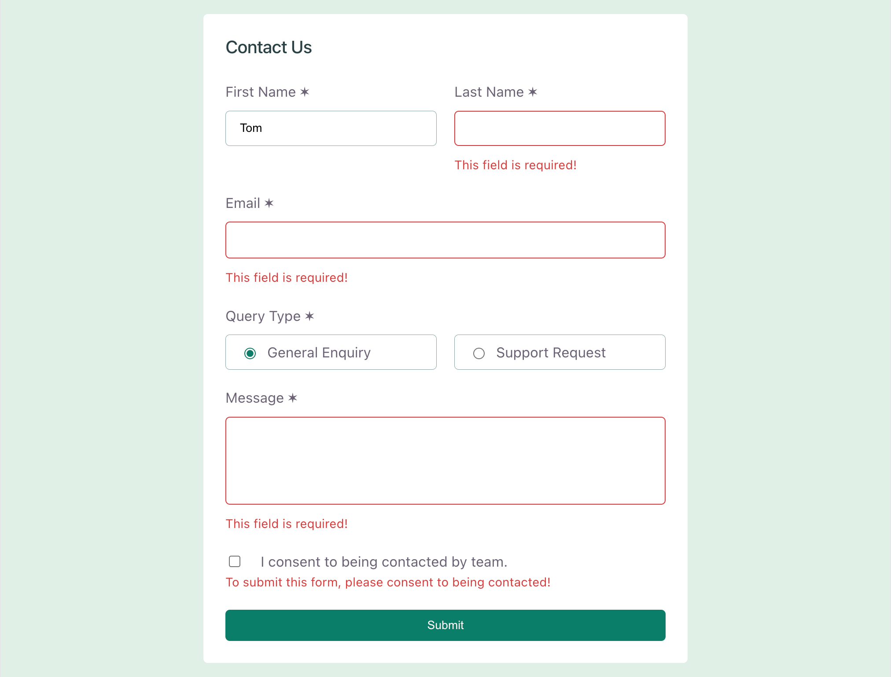
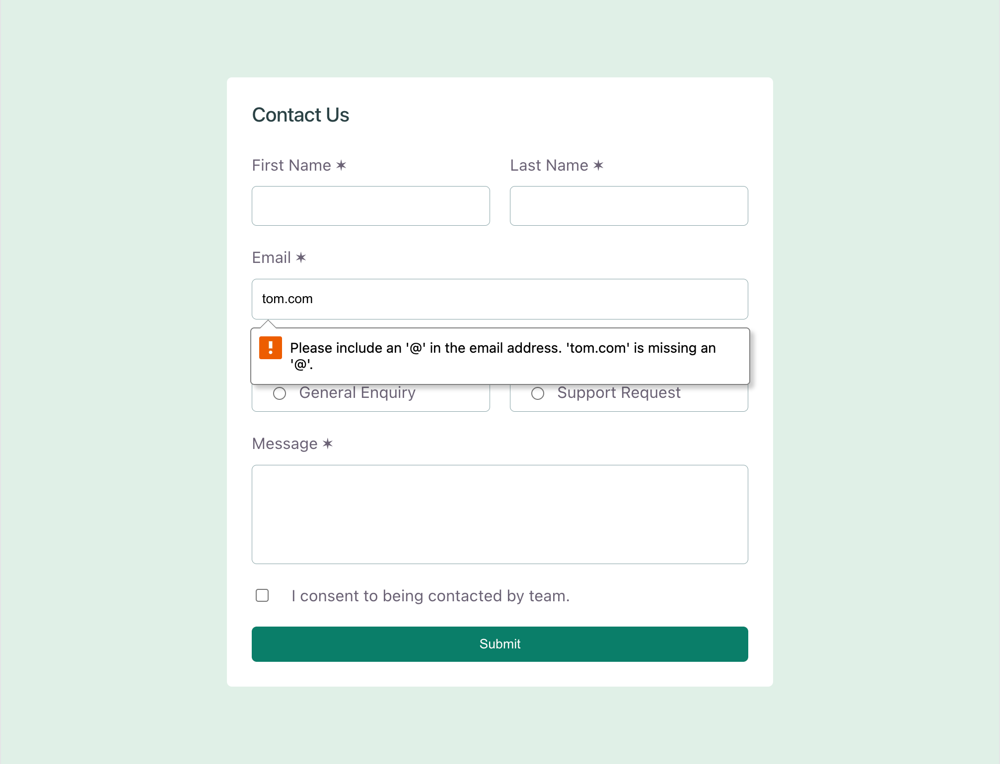
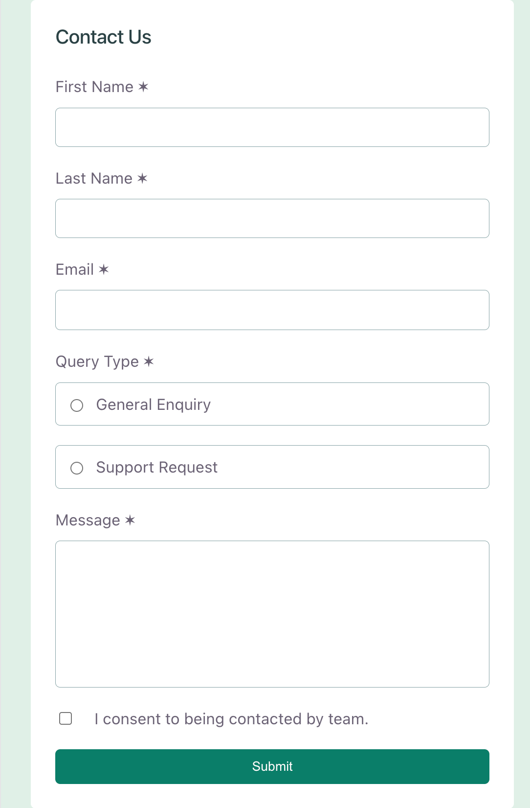
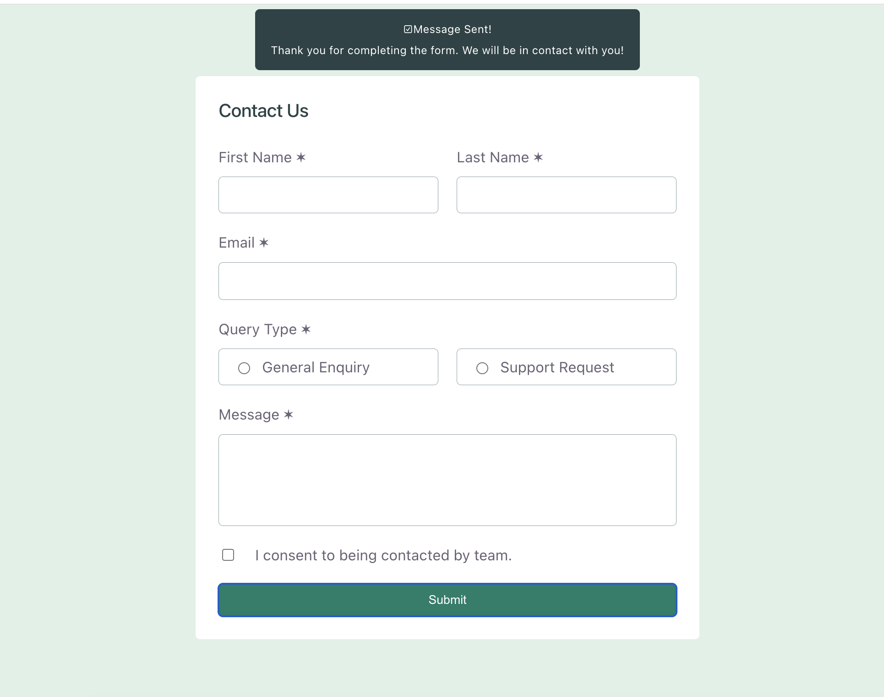

# Frontend Mentor - Contact form solution

This is a solution to the [Contact form challenge on Frontend Mentor](https://www.frontendmentor.io/challenges/contact-form--G-hYlqKJj). Frontend Mentor challenges help you improve your coding skills by building realistic projects.

## Table of contents

- [Overview](#overview)
  - [The challenge](#the-challenge)
  - [Screenshot](#screenshot)
  - [Links](#links)
- [My process](#my-process)
  - [Built with](#built-with)
  - [What I learned](#what-i-learned)
  - [Continued development](#continued-development)
- [Author](#author)


## Overview

### The challenge

Users should be able to:

- Complete the form and see a success toast message upon successful submission
- Receive form validation messages if:
  - A required field has been missed
  - The email address is not formatted correctly
- Complete the form only using their keyboard
- Have inputs, error messages, and the success message announced on their screen reader
- View the optimal layout for the interface depending on their device's screen size
- See hover and focus states for all interactive elements on the page

### Screenshot










### Links

- Solution URL: [Add solution URL here](https://github.com/MSaadat1/contact-form-main)
- Live Site URL: [Add live site URL here](gilded-kitten-740530.netlify.app)

## My process

### Built with

- Semantic HTML5 markup
- CSS custom properties
- Flexbox
- Mobile-first workflow
- [React](https://reactjs.org/) - JS library
- [Next.js](https://nextjs.org/) - React framework
- [Styled Components](https://styled-components.com/) - For styles

## What I learned

During this project, I learned how to build a functional form using React and improve my understanding of frontend development.

Some key things I learned:

- How to create a React project using Vite.
- How to organize a React project structure and manage assets.
- How to create reusable components and manage form inputs with React state.
- How to handle user input using `useState`.
- How to create form validation and display error messages.
- How to handle form submission and show a success message.
- How to work with radio buttons, checkboxes, and text areas in React.
- How to style a responsive layout using CSS Flexbox.
- How to use CSS variables to manage colors and keep styles organized.
- How to make a design responsive for desktop and mobile screens.
- How to use Git and GitHub to track and publish my projects.
- How to deploy a React application using Netlify.

To see how you can add code snippets, see below:

```react
function clearError(field) {
    setErrors((prev) => ({
      ...prev,
      [field]: "",
    }));
  }
<label htmlFor="firstName">First Name ✶</label>
            <input
              id="firstName"
              type="text"
              className={errors.firstName ? "inputError" : ""}
              value={firstName}
              onChange={(e) => {
                setFirstName(e.target.value);
                clearError("firstName");
              }}
            />
            {errors.firstName && <p className="error">{errors.firstName}</p>}
```

## Continued Development

There are still areas I would like to improve and practice in future projects:

- Improve my React component structure and make components more reusable.
- Practice more advanced React concepts such as custom hooks and context API.
- Add better form validation and improve user experience.
- Learn more about accessibility and make forms easier to use for all users.
- Improve my CSS skills, especially responsive design and layouts.
- Add animations and smoother user interactions.
- Continue practicing React projects to build more confidence.


## Author

- Website - [Mezhgan](https://dev-portfoliodollar.pantheonsite.io/)
- Frontend Mentor - [@MSaadat1](https://www.frontendmentor.io/profile/yourusername)
- github - [@MSaadat1](https://github.com/MSaadat1)


